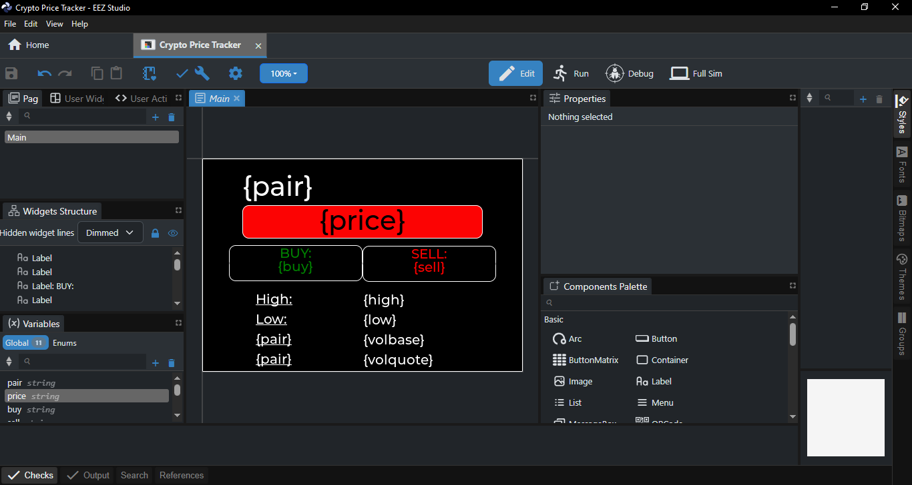

# Crypto Price Tracker ESP32+EEZ-Studio

A real-time cryptocurrency ticker built with an ESP32, a TFT touchscreen display, and the LVGL graphics library. This project fetches live market data directly from the [Indodax API](https://indodax.com/) and features a touch-enabled graphical user interface that changes dynamically based on market movements.



## ✨ Features

- **Real-time Updates:** Fetches live price data (Last, Buy, Sell, High, Low, and Volume) directly from the Indodax API.
- **Touch Interface:** Supports gesture-based switching between different cryptocurrency pairs.
- **Visual Indicators:** The UI background color changes dynamically to indicate market movement (Green for price increase, Red for decrease).
- **Multitasking:** Utilizes ESP32 FreeRTOS tasks to handle networking and display rendering independently for smooth performance.

## 🛠 Hardware Requirements

- **ESP32** Development Board
- **TFT Display** (ST7796) compatible with `TFT_eSPI`.
- **XPT2046 Touch Controller** (Touch CS pin configured to `21`).

## 📦 Software Dependencies

You will need the following libraries installed in your PlatformIO environment:

- [TFT_eSPI](https://github.com/Bodmer/TFT_eSPI) (Configuring `User_Setup.h` via `platformio.ini`)
- [XPT2046_Touchscreen](https://github.com/PaulStoffregen/XPT2046_Touchscreen)
- [lvgl](https://github.com/lvgl/lvgl) (Configuring `lv_conf.h` via `platformio.ini`)
- [ArduinoJson](https://arduinojson.org/) (Version 6.x)

## ⚙️ Configuration & Setup

### Wi-Fi Setup

Open the `main.cpp` file and update the network credentials with your Wi-Fi details:

```cpp
const char *networkSSID = "<Your SSID>";
const char *networkPASS = "<Your PASS>";
```

## Adding Custom Pairs

Simply add the new pair to the `marketPair` array at the top of your main sketch. The code automatically calculates the array size, so no other changes are needed!

```cpp
const char *marketPair[] = {"BTC/IDR", "ETH/IDR", "SOL/IDR", "BNB/IDR", "DOGE/IDR"};
```
